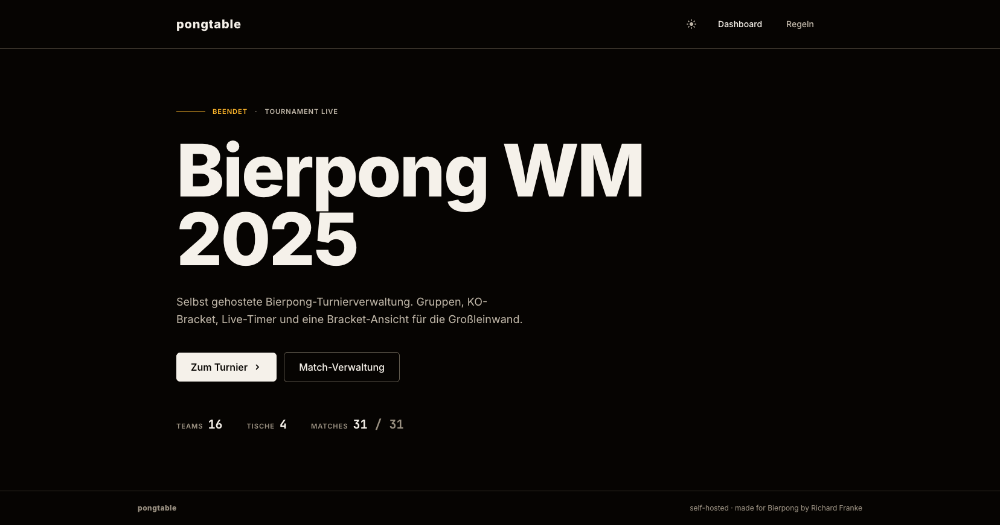
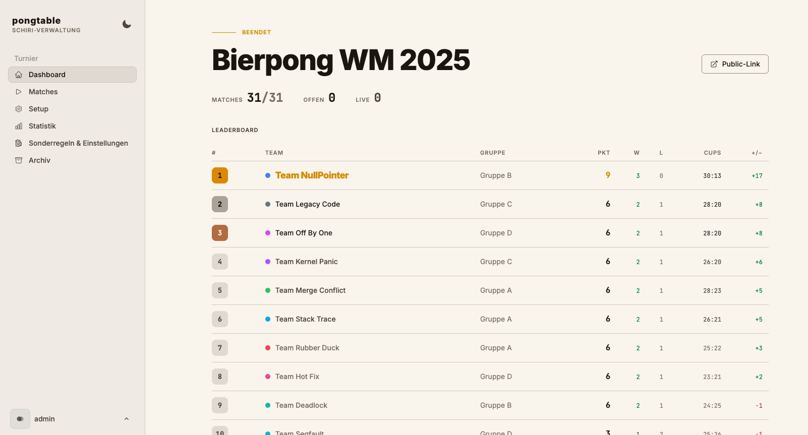
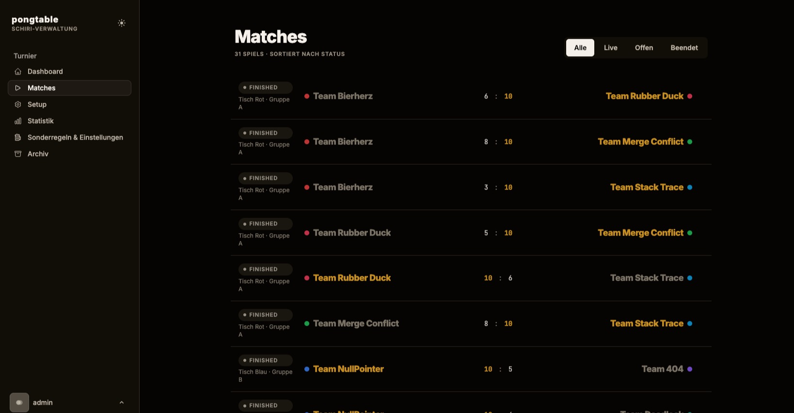
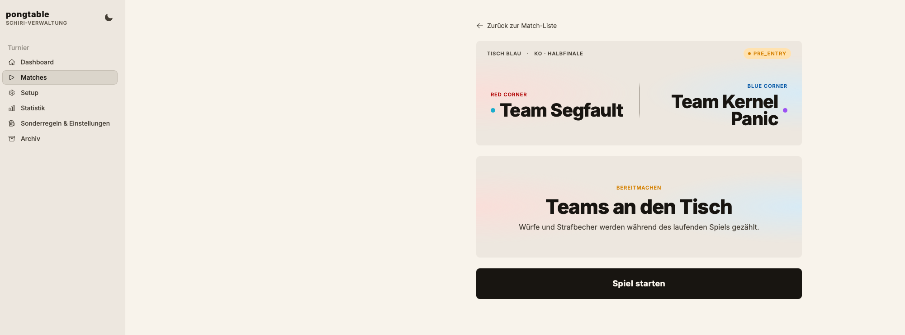
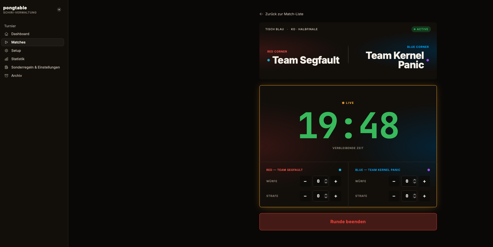
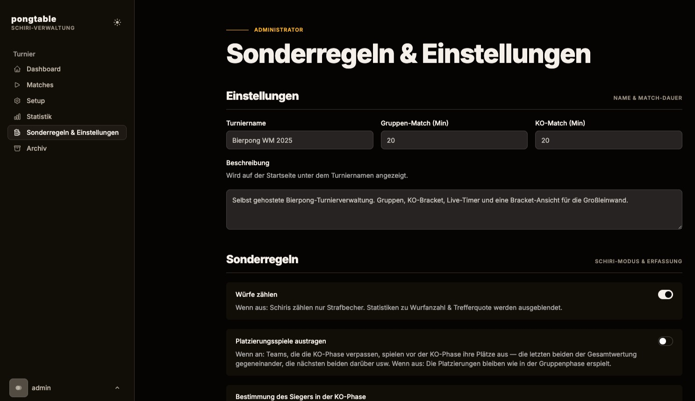
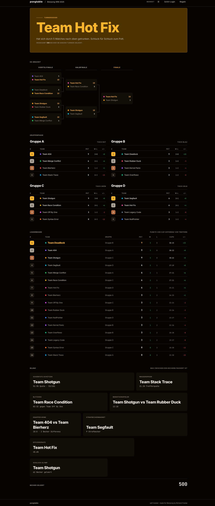

# Pongtable
Eine Turniersoftware für unsere Bierpong WM, mit Gruppenphase, KO-Bracket und Live-Dashboard, selbst hostbar über LaravelCloud, lokal 
per Docker, o.ä.
Aufgrund fehlender Alternativen selbst gebaut und stetig erweitert.
### Runs
[](https://github.com/Ric16Fr/pongtable/actions/workflows/phpLinting.yml)
[](https://github.com/Ric16Fr/pongtable/actions/workflows/runBrowsertests.yml)
[](https://github.com/Ric16Fr/pongtable/actions/workflows/runFeatureAndUnitTests.yml)


## Screenshots
Diese Screenshots stellen natürlich nur eine Auswahl aller Seiten dar. Für die volle Experience einfach das Tool selbst deployen und die 
einzelnen Phasen austesten.



*Das ist die Startseite für Gäste*


*Das Dashboard für den Admin, wie alle Seiten auch im Lightmode verfügbar*


*Übersicht über alle Turniere, von hier aus können diese gestartet werden*


*Vorbereitungsansicht, das Turnier wird in der öffentlichen Sicht auch bereits hervorgehoben, sodass die Spieler an den Tisch kommen- 
Hier mal wieder im Lightmode*


*Schiriansicht während des Turniers*


*Seite zur Verwaltung der Sonderregeln*


*Öffentliche Ansicht bei einem fertig ausgespielten Turnier*

## Features

- beliebig viele Teams und Spieltische erstellbar
- automatischer Gruppenmodus (per Auslosung), verteilung auf die Spieltische (falls mehr Gruppen gewünscht, einfach Dummytische erstellen)
- ernennung von Schiris, welche die Spielergebnisse eintragen
- Eintragungsmöglichkeit für die Anzahl an Würfen pro Team und den Strafbechern (nicht notwenig, aber für die Statistiken nett)
- öffentliches Dashboard für das aktuelle Turnier
- diverse lustige Statistiken
- Diagramm für die KO Runden
- Dark und Lightmode
- Docker-Unterstützung
- coole Urkunden mit den Platzierungen und den lustigen Statistiken, die nach dem Turnier als PDF generiert werden können

## Was aktuell nicht geht
- mehrere getrennte Accounts, dies ist primär ein Tool für den eigenen Gebrauch
- mehrere verschiedene Turniere zeitgleich, da mein Fokus auf einem Turnier lag
- QR-Codes für das Leaderboard, bei Interesse einfach mit der eigenen URL erstellen
- Download der Ergebnisse als CSV, dafür gibt es aber das Archiv

## Gesonderte Funktionen (teilweise geplant)
- [x] festlegen der Gruppen per CSV anstelle von Auslosung (falls die Gruppen live festgelegt oder vorab ausgelost werden sollen) 
- [x] ein Archiv mit vergangenen Turnieren
- [x] Sonderregeln, etwa wie der Sieger in der KO-Phase bestimmt wird
- [x] Platzierungsspiele nach Ende der Gruppenphase
- [x] Generierung von Zertifikaten (wenn ich mal viel Zeit hab)
- [ ] ggf. Wünsche vom lokalen Studentenclub

## Doku
Für (unsere) Bierpongregeln gibt es eine Seite direkt in dem Projekt. Dafür das Tool deployen und im Header auf "Regeln" klicken.
Eine, teilweise technische, detaillierte Beschreibung allerFeatures (organisiert nach den Elementen in der Sidebar) findet man im
`docs`-Ordner, empfohlener Start: [README](docs/README.md)

## Installation
### Per Docker
Will man das Projekt per Docker laufen lassen muss man erst trotzdem die .env generieren und einen App Key setzen. Dazu zuerst die Datei 
aus dem Template mit `cp .env.example .env` kopieren.

In der Datei kann man dann APP_URL auf den gewünschten Host setzen, z.B. http://localhost:8080. Dann muss man den App-Key mit
`docker compose run --rm app php artisan key:generate --show` erzeugen und auch in der .env Datei eintragen (unter APP_KEY).
Nun kann das Projekt per `docker compose up -d --build` gestartet werden.


### Mit Laravel Herd
> Hinweis: Bitte darauf achten, dass folgende Abhängigkeiten installiert sind:
> - PHP 8.5
> - [Composer](https://getcomposer.org/download/) 2.10 oder neuer
> - [bun](https://bun.sh) 1.3.14 oder neuer
> 
> Sonst funktionieren die Skripte nicht!

Man kann das Projekt mit Herd lokal laufen lassen (dafür einfach klonen, [Herd installieren](https://herd.laravel.com/docs/windows/getting-started/installation) (die Standardversion reicht völlig) und der [Anleitung von Herd](https://herd.laravel.com/docs/windows/getting-started/sites#linking-an-existing-site) zum verbinden eines existierenden 
Projektes folgen). Das geht super unter Windows und MacOS, unter Linux muss man sich beispielsweilse mit Sail selbst einen Server aufsetzen.

Anschließend müssen die benötigten Abhänigkeiten installiert werden, dafür gibt es unter `/scripts` ein 
vorgefertigtes Skript für das jew. Betriebssystem (das nur composer und bun aufruft und dann den Application Key generiert, einfach reinschauen 😉).
Dann müsste die Instanz erreichbar sein und man hat auch automatisch den Adminaccount mit dem Nutzernamen _admin_ und dem Passwort _password_ (dieses sollte man unten links über 
Account->Einstellungen dann natürlich ändern) und kann dort in den Einstellungen auch beliebig viele Schiedsrichter-Accounts anlegen. 
Diese Accounts können (anders als der Admin) die Turniereinstellungen nicht ändern, sondern nur Ergebnisse der Matches eintragen.

## Demodaten 
Es ist möglich, Demodaten anzulegen, etwa um das Tool jemandem vorzustellen zu können. Dafür gibt es neben dem Standardfall drei DB-Seeder, 
die unterschiedliche Zeitpunkte visualisieren:

|Kommando|Beschreibung|Änderungen|
|-----|---|-----|
|php artisan migrate:fresh|Setzt die Datenbank auf den Werkszustand zurück. Wird auch über die Skripte erledigt und ist empfohlen, wenn man frisch starten will, die bisher eigetragenen Daten unplausibel sind oder die Accounts zurücksetzen will.|- löscht alle vorhandenen Daten<br/>- legt einen Adminaccount mit Standardpasswort an<br/>- keine sonstigen Gruppen, Archivdaten, Teams<br/>- Sonderregeln auf Standardeinstellungen|
|php artisan db:seed |Legt Demodaten an, direkt zu Beginn eines Turniers. Es gibt bereits die ersten wichtigen Daten, alles andere muss selbst angelegt werden.  Und einen Eintrag im Archiv als Beispiel eines fertigen Turniers. Gut, um einen schnellen Einstieg zu haben und sich das langwierige anlegen der Teams zu sparen. |- legt 4 Tische und 16 Gruppen an <br/>- Gruppenphase aber noch nicht ausgelost<br/>- legt ein fertiges Turnier im Archiv an<br/>- legt 4 Schiri Accounts an|
|php artisan migrate:fresh --seed --seeder=GroupPhaseSeeder|Erweiterung des vorherigen Seeders, bei dem direkt 4 der jeweils 6 Spiele pro Gruppenphase mit realistischen Ergebnissen beendet wurden. So kann man einen Blick auf die Statistikseite werfen und das Ende der Gruppenphase schnell simulieren.|- Gruppenphase ausgelost<br/>- 4 von 6 Spielen pro Gruppe sind ausgespielt<br/>- realistische Ergebnisse und Statistiken vorhanden<br/>- sonst wie der vorherige Standardseeder|
|php artisan migrate:fresh --seed --seeder=KOPhaseSeeder|Nächste Stufe des Spiels, die Gruppenphase ist komplett beendet und wir befinden uns in der KO-Phase (nach dem Viertelfinale). Praktisch, um das KO-Bracket zu testen und schnell ein fertiges Turnier zu simulieren|- Gruppenphase ausgelost<br/>- alle Spiele der Gruppenphase sind ausgespielt<br/>- Viertelfinale der KO-Phase beendet<br/>- Halbfinale angelegt, aber noch nicht gespielt<br/>- realistische Ergebnisse und Statistiken vorhanden<br/>- sonst wie der Standardseeder|

> Hinweis: Keiner der Seeder nutzt vom Standard abweichende Sonderregeln. 
> Wenn diese gezeigt oder getestet werden sollen, muss der Standardseeder verwendet, die Regel aktiviert und dann normal ein Spiel simuliert werden.
> Siehe dafür auch [Sonderregeln](docs/Sonderregeln.md)

## Testsuite
Für den Fall dass, bei einer eigenen Weiterentwicklung oder vor einem PR die vorhandenen Unit, Feature und Webtests ausgeführt werden 
sollen muss 
einmalig

``` shell
composer install
bun install
bunx playwright install
```
aufgerufen werden, dies installiert dann alle Dependencies, anders als über das Skript (welches nur die produktiven installiert), und die 
Browser für Playwright.
Dann können die Tests über `./vendor/bin/pest` gestartet werden.
